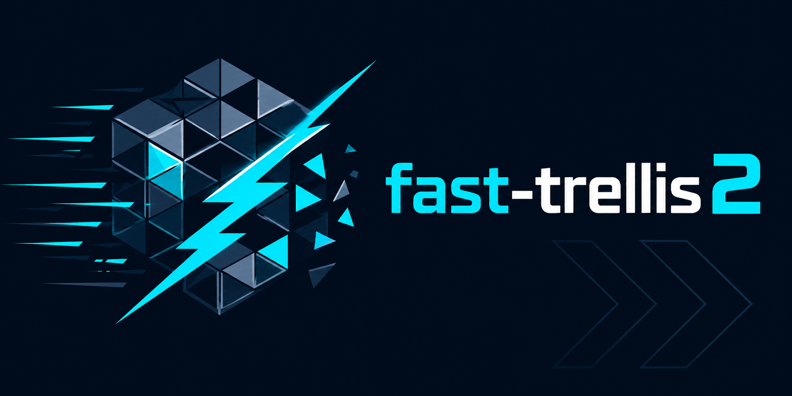

<div align="center">



# 🛠 fast-trellis2

**[Fast-TRELLIS](https://github.com/wlfeng0509/Fast-SAM3D/tree/Fast-TRELLIS)'s training-free acceleration, faithfully ported onto [TRELLIS.2](https://github.com/microsoft/TRELLIS).**

[](./LICENSE)
[](https://github.com/microsoft/TRELLIS.2)
[](https://arxiv.org/abs/2512.14692)
[](https://github.com/wlfeng0509/Fast-SAM3D/tree/Fast-TRELLIS)

`TRELLIS.2-4B` · `1024_cascade` (mesh + texture) · training-free · single RTX 5090 · MIT

</div>

> **This is a port, not a new method.** It re-implements the acceleration introduced by
> **Fast-TRELLIS** (built for TRELLIS v1) on the **v2** sampler stack, so you get the same
> speedup on TRELLIS.2. All credit for the acceleration design belongs to the Fast-TRELLIS
> authors; all credit for the base model belongs to microsoft/TRELLIS.2. For our *own*
> acceleration method on v2 — a Hermite (HiCache) sparse-structure forecast paired with a
> token-carved SLaT sampler — see the sibling repo **hermit-trellis2**.

`fast-trellis2` wires Fast-TRELLIS's cross-step caching into TRELLIS.2's three flow-matching
stages (sparse structure + shape SLaT + texture SLaT). Microsoft TRELLIS.2 model / decoder /
o-voxel code is left untouched.

## When to use this repo

These repos are **complementary accelerators, not competing solutions** — each speeds up a *different*
base generator, and the `+` / `++` suffix is a **method choice**, not a rival product. Pick by
**(1) which base model you run**, then **(2) which forecast basis you want**:

| base generator | `+` = HiCache (Hermite) | `++` = HiCache++ (DMD) |
|---|---|---|
| Hunyuan3D-2.1 | `hunyuan2.1-plus` | `hunyuan2.1-plus-plus` |
| Hunyuan3D-2 mini | `hunyuan2-plus` | `hunyuan2-plus-plus` |
| SAM 3D Objects | `sam3d-plus` | `sam3d-plus-plus` |
| Fast-SAM3D | `fastsam3d-plus` | `fastsam3d-plus-plus` |
| DiT-XL/2 (ImageNet) | `dit-plus` *(unreleased)* | `dit-plus-plus` *(unreleased)* |
| TRELLIS (v1) | `faster-trellis` | `faster-trellis-plus-plus` |
| TRELLIS.2-4B (v2) | `hermit-trellis2` | `hermit-trellis2-plus-plus` |

- **`+` (HiCache / scaled-Hermite):** the *published* polynomial velocity-forecast basis — conservative, reproduces the HiCache paper. Use it to deploy the established method.
- **`++` (HiCache++ / DMD exponential):** our Dynamic-Mode-Decomposition basis — *the same near-lossless quality at wider skip intervals*, where the polynomial diverges. Use it when you push the cache interval for more speed.
- **standalone / model-agnostic:** [`hicache-plus-plus`](https://github.com/Archerkattri/hicache-plus-plus) — the forecaster itself, to add DMD caching to *your own* diffusion/flow model.
- **`fast-trellis2`** = the TaylorSeer baseline fork (the upstream "Fast" accel) — the v2 reference point, not a HiCache variant.

> **This repo:** `fast-trellis2` — **TRELLIS.2-4B × TaylorSeer baseline fork** — the upstream "Fast" accel, the v2 reference point.

---

## At a glance

40 Toys4K objects, `1024_cascade`, **RTX 5090**, seed 42; means over the 35 objects every
config completed in one run. Geometry is scored on the o-voxel mesh decoder output with
area-weighted surface sampling, after a globally-optimal (Go-ICP) similarity alignment to the
ground-truth mesh. Latency is end-to-end generation, one object at a time, weights resident.

| config | F1@0.05 mean ↑ | F1 median ↑ | CD ↓ | latency ↓ | speedup |
|---|:--:|:--:|:--:|:--:|:--:|
| base TRELLIS.2 (unaccelerated) | 0.860 | 0.932 | 0.057 | 11.75 s | 1.00× |
| **fast-trellis2** (this port) | 0.900 | 0.959 | 0.048 | 6.23 s | **1.89×** |

<sub>CD ↓ lower is better; F1 ↑ higher is better. **The cross-step caching cuts latency ~1.9×
while *improving* geometry** — higher mean F-score (0.900 vs 0.860) and lower Chamfer distance
(0.048 vs 0.057) than the unaccelerated base. The mean is deflated by a few rotationally-symmetric
objects (ball, bowl…) Go-ICP cannot orient uniquely, hence the per-object median alongside. For our
own v2 acceleration method — the Hermite carved hybrid (HiCache SS forecast + token-carved SLaT) —
see the sibling repo **hermit-trellis2**.</sub>

---

## Quickstart

```bash
git clone --recursive https://github.com/Archerkattri/fast-trellis2
cd fast-trellis2
bash setup.sh --new-env --basic --flash-attn --o-voxel --flexgemm --nvdiffrast --nvdiffrec
```

Enable acceleration by swapping in the ported samplers; the pipeline auto-detects them and
flips `enable_faster` on:

```python
from trellis2.pipelines import Trellis2ImageTo3DPipeline, samplers

pipeline = Trellis2ImageTo3DPipeline.from_pretrained("microsoft/TRELLIS.2-4B").cuda()

pipeline.sparse_structure_sampler = samplers.FlowEulerGuidanceIntervalSampler_taylor(
    sigma_min=pipeline.sparse_structure_sampler.sigma_min)
pipeline.shape_slat_sampler = samplers.FlowEulerGuidanceIntervalSampler_faster(
    sigma_min=pipeline.shape_slat_sampler.sigma_min)
pipeline.tex_slat_sampler = samplers.FlowEulerGuidanceIntervalSampler_faster(
    sigma_min=pipeline.tex_slat_sampler.sigma_min)
# pipeline.enable_faster auto-enables once the *_faster / *_taylor samplers are set.

mesh = pipeline.run(image)[0]
```

See `example.py` (stock) and `example_faster.py` (accelerated).

<details>
<summary><b>RTX 50-series (sm_120) note</b></summary>

Select the spconv backend and its native algorithm:

```bash
SPARSE_CONV_BACKEND=spconv SPCONV_ALGO=native python example_faster.py
```

`SPCONV_ALGO` is read from the environment (`trellis2/modules/sparse/conv/config.py`); `native`
is recommended on newer GPU architectures.
</details>

---

## What the port replicates

Fast-TRELLIS's three components, wired into the TRELLIS.2 samplers (all credit: Fast-TRELLIS):

| component | what it does | where |
|---|---|---|
| **TaylorSeer on SS** | sparse-structure stage caches the final velocity, Taylor-extrapolates on skipped steps | `taylor_utils_ss/` |
| **SLaT delta-cache** | shape/texture SLaT reuse a cached velocity delta, gated by a learned sensitivity `k` + cosine-direction error | `faster_utils_slat/` |
| **Token carving** | voxels ranked by 3D high-frequency energy; low-freq tokens skipped on a fraction of steps, restored from cache | `token_slat/`, `fft/fft3d.py` |

<details>
<summary><b>v1 → v2 port notes</b> (API / schedule adaptations only — no logic changes)</summary>

- v1 `cfg_strength` / `cfg_interval` → v2 `guidance_strength` / `guidance_interval`.
- v1's single CFG-in-interval mixin → v2's split MRO (`GuidanceIntervalSamplerMixin`,
  `ClassifierFreeGuidanceSamplerMixin`, base).
- v1's fixed 25-step cache schedule → parameterised to v2's shorter (~12-step) schedule, scaled
  to the actual step count (warm-up steps + an always-full final step). See the comments in
  `trellis2/pipelines/samplers/flow_euler.py`.
- Token carving auto-disables on the cascade-upsampling and texture stages (carved indices no
  longer align once coords are re-derived / a concat conditioning tensor is present); the easy
  delta-cache still applies. Logged at runtime.

Ported code: `trellis2/pipelines/samplers/flow_euler.py`, `.../samplers/__init__.py`,
`trellis2/pipelines/trellis2_image_to_3d.py` (`enable_faster`, `coords_scores`), and the util
packages `taylor_utils_ss/`, `faster_utils_slat/`, `token_slat/`, `fft/`.
</details>

---

## Credits & license

This repo **reproduces the method of, and depends on, two MIT-licensed projects** — both are
credited because this work reproduces their contributions:

| | |
|---|---|
| **microsoft/TRELLIS.2** | the base image-to-3D model, pipeline, and decoders |
| **Fast-TRELLIS** | [wlfeng0509/Fast-SAM3D (Fast-TRELLIS branch)](https://github.com/wlfeng0509/Fast-SAM3D/tree/Fast-TRELLIS) — the training-free acceleration this repo ports to v2 |

MIT. See [`LICENSE`](LICENSE) and [`NOTICE`](NOTICE). The port wiring © 2026 Krishi Attri; the
acceleration design © the Fast-TRELLIS authors; the base model © Microsoft.

**Krishi Attri** · krishiattriwork@gmail.com · [github.com/Archerkattri](https://github.com/Archerkattri)

<details>
<summary><b>BibTeX</b></summary>

```bibtex
@misc{attri2026fasttrellis2,
  title  = {fast-trellis2: Fast-TRELLIS acceleration ported to TRELLIS.2},
  author = {Krishi Attri}, year = {2026},
  howpublished = {\url{https://github.com/Archerkattri/fast-trellis2}}
}
@article{trellis2,
  title   = {Native and Compact Structured Latents for 3D Generation},
  author  = {Microsoft TRELLIS.2 Team},
  journal = {arXiv preprint arXiv:2512.14692}, year = {2025}
}
@misc{fasttrellis,
  title  = {Fast-TRELLIS}, author = {wlfeng0509},
  howpublished = {\url{https://github.com/wlfeng0509/Fast-SAM3D/tree/Fast-TRELLIS}}
}
```
</details>

---

## Family

Part of the **HiCache++ acceleration family**.

- **Family hub:** [`hicache-plus-plus`](https://github.com/Archerkattri/hicache-plus-plus) — the basis library behind this adapter.
- **Siblings (same base model, our HiCache-family accelerators):** [`hermit-trellis2`](https://github.com/Archerkattri/hermit-trellis2) — HiCache (scaled-Hermite) — and [`hermit-trellis2-plus-plus`](https://github.com/Archerkattri/hermit-trellis2-plus-plus) — HiCache++ (Dynamic Mode Decomposition / Prony).
